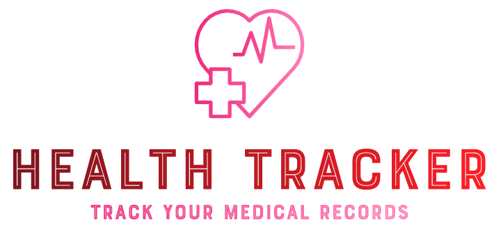

# Health Tracker

    
     An application built to help you keep track of your medical records and perscriptions. 

---

## Motivation

Tracking Medication should not be a difficult task, however, it can become extremely difficult if one is suffering from a chronic condition or if one is trying to figure out what health modalities can help improve performance. Using a Medicine Tracker app can greatly improve your adherence.

The main motto to take up this problem is to cater to each and every need of the patient as well as monitor his/her health from the time he/she first visits the hospital till he/she totally recovers.

## Installation

**Prerequisites** : Python 3 and Pygame module.

For the latest stable version, head to [Releases](https://github.com/SVijayB/Health-Tracker/releases).

Download and extract the source code.

As an alternative, you could also clone the repository using,

<pre>
git clone https://github.com/SVijayB/Health-Tracker.git
</pre>

Before running the application, you need to install the [Pygame](https://pypi.org/project/pygame/) module. To do so, launch your terminal and type `pip install pygame`. Once completed, you are ready to use the application.

You can also `cd` to the Health-Tracker directory on your terminal and type 

<pre>
pip install -r requirements.txt
</pre>

## Usage

Once you have all the files on your local system, you can launch it by double tapping the `Health_tracker.py` file present in the **`src`** folder. You can do this only if you have the *python launcher* installed.

Else, `cd/` to the src folder on your terminal and type `python Health_tracker.py`.

Now, create an account and login.

**Note** : Leave the program running in order to recieve reminders at the right time.

## Contributing 

To contribute to Health-Tracker, fork the repository, create a new branch and send us a pull request. Make sure you read [CONTRIBUTING.md](https://github.com/SVijayB/Health-Tracker/blob/master/.github/CONTRIBUTING.md) before sending us Pull requests. 

Also, thanks for contributing to Open-source!

## License 

Health-Tracker is under The MIT License. Read the [LICENSE](https://github.com/SVijayB/Health-Tracker/blob/master/LICENSE) file for more information.   
